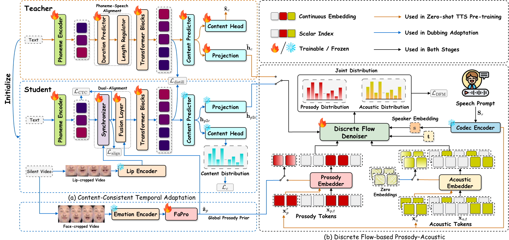

<h2>Discrete Flow Matching for Automated Video Dubbing via Cross-Modal Alignment and Synchronization</h2>

<a href="https://nngocson2002.github.io/"><strong><u>Ngoc-Son Nguyen</u></strong>1</a> &nbsp;&nbsp;&nbsp;
<a href="https://thanhtvt.github.io/"><strong><u>Thanh V. T. Tran</u></strong>1</a> &nbsp;&nbsp;&nbsp;
<a href="https://choijeongsoo.github.io/"><strong><u>Jeongsoo Choi</u></strong>2</a> &nbsp;&nbsp;&nbsp;
<a href="https://scholar.google.com/citations?user=sGFCHdcAAAAJ&hl=en"><strong><u>Hieu-Nghia Huynh-Nguyen</u></strong>1</a> &nbsp;&nbsp;&nbsp;
<a href="https://scholar.google.com/citations?user=JiKBo6UAAAAJ&hl=en"><strong><u>Truong-Son Hy</u></strong>3</a> &nbsp;&nbsp;&nbsp;
<a href="https://scholar.google.com/citations?user=rJe1704AAAAJ&hl=en"><strong><u>Van Nguyen</u></strong>1†</a>

1 FPT Software AI Center, Vietnam &nbsp;&nbsp; 2 KAIST, South Korea &nbsp;&nbsp; 3 University of Alabama at Birmingham, USA

† Corresponding author

 

## 🎬 Framework

  

